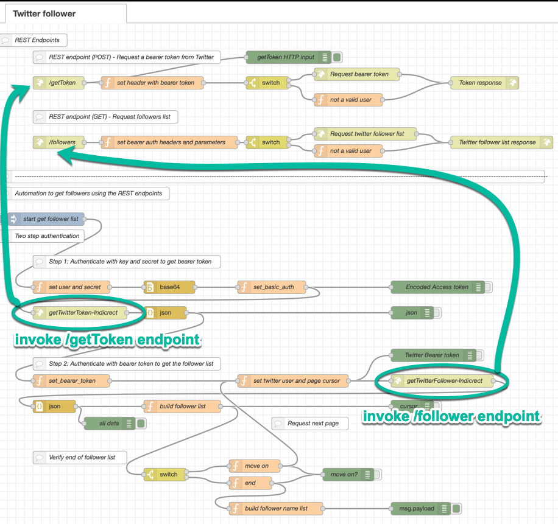

**!!!! UNDER CONSTRUCTION !!!!**

# Node-RED Twitter-follower-flow

Node-RED is very good for prototyping, that is the reason why it is often used in hackathons. If you are new to Node-RED and you start to develop a Node-RED flow, you normally have following challenges: 

* **How to ...**

  1. ... define own **REST endpoints** to encapsulate an external API?
  2. ... automate the **authentication** to that external API?
  3. ... **extract data** from the external API?
  4. ... **customize data** and **CRUD** with databases? 

The Node-RED flow of that project has the objective to provide an (little advanced) introduction to the first three topics above.
The database topic with CRUD isn't covered. The CRUD (Create, Read, Update, Delete) topic that is not covered here. You can visit that  [CRUD example](https://github.com/gitjps/Node-RED-Cloudant-CRUD).

* **The "Twitter-follower-flow" example ...**

  * ... is based on open technologies

  * ... creates no additional costs 
    * Uses a free runtime on IBM Cloud
    * Uses the free Twitter developer API

  * ... has following technical level:
    * Beginner to intermediate 
    * Needs a basic knowledge of JavaScript and REST

  * ... takes 30 - 45 min to setup the example from scratch
    1. Register on IBM Cloud 
    2. Create a Node-RED instance on IBM Cloud
    3. Register at Twitter for a developer API Account 
    4. Copy the existing Node-RED flow
    5. Configure the flow
    6. Run the flow


## 1. The UseCase

The UseCase **_"Extract the twitter follower list"_** addresses three topics listed above in the Node-RED _Twitter-follower-flow_.

  1. Define own **REST endpoints** to encapsulate Twitter developer API calls.
  2. Automate the **authentication** the two step authentication of the Twitter developer API.
  3. **Extract data** from the Twitter follower list and build an own list.

## 2. Topics of the Node-RED usage

The _Twitter-follower-flow_ is an concrete example of following topics ...

 * ... the **implementation** of Node-RED REST endpoints.

   1. Create a very basic authentication to protect each Node-RED endpoint
   2. Realize the two step authentication to access the Twitter developer API:
        1. Basic authentication with a key and secret to request a bearer token from Twitter
        2. Use the bearer token for authentication to use the Twitter API 
   3. Get the follower list from Twitter using the bearer token

 * ... the **usage** of the implemented REST endpoints to automate following sequence to get the Twitter follower.

   1. Get the **authorization** bearer token from Twitter to access the Twitter API
   2. Get all followers from Twitter using a **bearer token** ( _the challenge is: how implement the paging thought the followers list from Twitter_ )
   3. Extract the names of the follower from the follower list

 * ... the **work** with following Nodes in the Node-RED _Twitter-follower-flow_.

   1. Function _(Do small programming in javascript.)_
   2. Inject _(Start a flow in Node-RED.)_
   3. HTTP _in_ _(Creates an HTTP end-point for creating web services.)_
   4. HTTP _request_ _(Sends HTTP requests and returns the response.)_
   5. HTTP _response_ _(Sends responses back to requests received from an HTTP Input node.)_
   6. Base64 (A function that converts the chosen property (default msg.payload) to and from base64 format.)
   7. JSON _(Converts between a JSON string and its JavaScript object representation, in either direction.)_
   8. Switch _(Define a decision how to route the payload. Route messages based on their property values or sequence position.)_

 * ... the **usage** of flow variables to exchange values between functions in the _Twitter-follower-flow_.

---

## 3. Setup the Twitter-follower-flow example 

That section contains six major steps to setup the _Twitter-follower-flow_ example on IBM Cloud. 

1. Setup Twitter developer application
2. Create a Node-RED instance on IBM Cloud
3. Install a additional Node to the Node-RED instance
4. Import the Node-RED flow
5. Configure the Node-RED flow
6. (Optional) Example of an execution of the Node-RED flow

In the image you see the full flow.



---

### Step 1: Setup Twitter developer application

You need an Twitter account and a Twitter developer application.
With your Twitter account you can access **Twitter developer API** and create a Twitter application. That application provides the needed credenticals to access the Twitter API, which is used in that example.

#### a. [Link to add a Twitter developer application](https://developer.twitter.com/en/apps). 

Here is a blog post with an example how to setup a Twitter application: [How to Register a Twitter App in 8 Easy Steps](https://iag.me/socialmedia/how-to-create-a-twitter-app-in-8-easy-steps/)

Here is a preview, how to get the credentials from your Twitter developer application:


#### [b. Twitter API documentation `get-followers-list`](https://developer.twitter.com/en/docs/accounts-and-users/follow-search-get-users/api-reference/get-followers-list)

---

### Step 2: Create a Node-RED instance on IBM Cloud

We use a Node-RED instance on IBM Cloud with an IBM Lite Account.

1. Create an IBM Cloud Lite Account just by register [here](https://ibm.biz/Bdzr7G).
2. Follow the steps in my blog post to [setup a Node-RED instance on IBM Cloud](https://suedbroecker.net/2020/03/09/a-short-introduction-of-the-node-red-starter-kit-on-ibm-cloud-for-hackathons/)

---

### Step 3: Install a additional Node to the Node-RED instance

Install the `node-red-node-base64` **Node** to the Node-RED instance. The gif shows the installation.


---

### Step 4: Import the Node-RED flow

Import the flow from the [flow.json](flows/flows.json) file in `flows` folder of that project. The gif below shows how to import the flow in the Node-RED.


---

### Step 5: Configure the Node-RED flow

We need to configure ...

* ... the Twitter authentication 
* ... the Twitter username
* ... the Node-RED URL 

---

#### a. Set Twitter API key and secret

Insert the values for the `user` and `secret` of the Twitter API credentials in the _function_ `set user and secret`. The image shows a example, where you get the credentials information.


The mapping for the Node-RED flow:
  1. `user` = _Twitter API_ key
  2. `secret` = _Twitter API_ secret key
  3. `nodereduser` = Your own definition to secure the Node-RED REST Endpoints
  4. `noderedpassword` = Your own definition to secure the Node-RED REST Endpoints

Here is the source code for the `set user and secret` function.

```javascript
var user = "USER";
var secret = "SECRET"
var nodereduser = "admin";
var noderedpassword = "notreallysecure"

flow.set("nodereduser", nodereduser);
flow.set("noderedpassword", noderedpassword);

msg.payload = user + ":" + secret;

return msg;
```

#### b. Set Twitter username

Define _"username display name"_ you want get the follower list from, by inserting 
in function `set_basic_auth` the `"YOUR_TWITTER_DISPLAY_NAME"`.

```javascript
// Set basic auth
flow.set("auth", msg.payload);
msg.payload = flow.get("auth");

// Init parameters:
// For more information visit get-followers-list:
// https://developer.twitter.com/en/docs/accounts-and-users/follow-search-get-users/api-reference/get-followers-list
flow.set("twitterCursor", "-1");
flow.set("twitterResultCount", "50");
flow.set("twitterSN", "YOUR_TWITTER_DISPLAY_NAME");

msg.nodereduser = flow.get("nodereduser");
msg.noderedpassword = flow.get("noderedpassword");

return msg;
```
---

#### c. Set Node-RED URL

Configure the HTTP request nodes. Replace the `https://node-red-my-hackathon.mybluemix.net` URL with your URL in each _HTTP request node_:

* `getTwitterFollower-Indicrect`
* `getTwitterToken-Indicrect`

The image shows how you enter the URL in the _HTTP requests node_ `getTwitterFollower-Indicrect`.


That image shows _HTTP requests nodes_ to be change.


---

### Step 6: Example of an execution of the Node-RED flow

**TBD YouTube Video**

---

## 4. Understand the content of the _Twitter-follower-flow_

1. Implementation of REST endpoints in the Node-RED
2. Automation of the flow to get followers from the Twitter API

### 4.1 Implementation of REST endpoints in the Node-RED 

That is the implementation of the REST endpoints in Node-RED _Twitter-follower-flow_. 

Both Node-RED HTTP endpoints encapsulating the invocation of the Twitter API call.
Each endpoint validates the custom defined `nodeusername` and `noderedpassword`, before they start to send the REST call of the **Twitter API** and provide the result.
 
* Endpoint _(POST)_: `/getToken` Gets the bearer token from the Twitter API and saves the token in a flow variable.
* Endpoint _(GET)_: `/followers` Does the authorization with the bearer token and gets a follower list for a _user display name_ in a _page size_ of 50 entries.


That is a simplified view of the combination of the _Node-RED Nodes_ **"HTTP in"**, **HTTP request** and **HTTP response** to implement the REST endpoints.


---

##### 4.1.1 Endpoint to request the followers

This endpoint does encapsulate the invocation of the external Twitter API call `followers/list`. The Node-RED endpoint very basiclly secured with a `noderedusername` and a `noderedpassword`. Only when the simple verification was successful, the Twitter API call can be invoked. The Twitter API invocation is done with authorization of the bearer token and gets a follower list for a user display name in a page size of 50 entries. The image shows the endpoint. 


**Endpoint (GET):** `/followers` That endpoint has following query parameters:
* `screen_name`
* `count`
* `cursor`
* `nodereduser`
* `noderedpassword`

```javascript 

  //https://[YOUR NODE_RED URL]/followers?screen_name={{twitterSN}}}&count={{{twitterCount}}}&cursor={{{twitterCursor}}}&nodereduser={{{nodereduser}}}&noderedpassword={{{noderedpassword}}}

```
  
This is the **Twitter API** invocation in the HTTP node `Request twitter follower list`, when the simple user validation was successful.

```javascript

  //https://api.twitter.com/1.1/followers/list.json?screen_name={{{twitterSN}}}&cursor={{{twitterCursor}}}&count={{{twitterCount}}}

```

##### a. Function node: `set bearer auth headers and parameters`

That function Node verifies the `nodereduser`/`noderedpassword` input of the HTTP request and loads the flow variable `bearer_token` and collects the query parameter `screen_name`, `cursor`and `count` for the Twitter API endpoint invocation.

```javascript
// validate the request user and password
if ( msg.payload.nodereduser === flow.get("nodereduser") && msg.payload.noderedpassword === flow.get("noderedpassword")){
 
    // Get variables
    bearer_token = flow.get("bearer_token");
     
    msg.headers = {
         'Authorization' : bearer_token
    }
    
    // Get query parameter
    msg.twitterSN =  msg.req.query.screen_name;
    msg.twitterCursor =  msg.req.query.cursor;
    msg.twitterCount =  msg.req.query.count;
    
    msg.valid_request = 1;
  
} else {
    msg.valid_request = 0;
}
  
return msg;
```

---

#### 4.1.2 Endpoint to request the bearer token from twitter

This endpoint does encapsulate the invocation of the external Twitter API call `getToken`. To secure the Node-RED endpoint very basiclly it validates a `nodereduser` and `noderedpassword`. The Twitter API endpoint itself is secured by a basic authentication with a _Twitter key_ and _secret_. The `getToken` call requests the bearer token from the Twitter API and saves the token in a flow variable. The Twitter API provides the `getToken` endpoint. 
The image shows the endpoint.


* Flow endpoint (POST): `/getToken`
* Twitter API request: `https://api.twitter.com/oauth2/token`

Let's get a deeper look in the function implementation.

* Function: `set header with bearer token`

In the `set header with bearer token` function, we load the base64 encoded `auth` string and we configure the HTTP `auth` header for the Twitter API request.

```javascript
// validate the request user and password
if ( msg.payload.nodereduser === flow.get("nodereduser") && msg.payload.noderedpassword === flow.get("noderedpassword")){
  
  msg.headers = {
     'Authorization' : 'Basic ' + flow.get("auth"),
     'Content-Type' : 'application/x-www-form-urlencoded;charset=UTF-8.'
  };
  
  msg.payload = 'grant_type=client_credentials';
  msg.valid_request = 1;
  
} else {
  msg.valid_request = 0;
}
  
return msg;
```

---

### 4.2 Automation of the flow to get followers from the Twitter API

In this part of the flow we fully automate the authentication and extraction of the follower data.

We start that flow simply with pressing the _Inject Node_ `start get follower list` button. That is the simplified sequence we use:

   1. Get the **authorization** bearer token from Twitter to access the Twitter API
   2. Get all followers from Twitter using the **bearer token** ( _the challenge is: how implement the pageing thought the followers list from Twitter_ )
   3. Extract the names of the follower from the follower list

_Remember:_ The authorization for the Twitter API needs a two step Authentication and we protect the Node-RED REST endpoints with a simple authenication. 

The image displays the relevant part of the flow.


That are the different main chapters of the automation.

   1. Get bearer token from Twitter to access the Twitter API
   2. Load and build the follower list from Twitter
   3. Verify the end of follower list
   4. Build the final followers list

---

#### 4.2.1 Get bearer token from Twitter to access the Twitter API

The image displays the relevant part of the flow.


Let's get a deeper look in the function implementations.

##### a. Function node: `set_basic_auth`

In that function we set the following flow variables to prepare the `auth` for the Twitter API token request.

 * `auth` EncodedBase64 user and secret combination.
 * `twitterCursor` The page position of for the followers list.
 * `twitterResultCount` The response size of the followers for one page. 
 * `twitterSN` Define the Twitter user name for the followers list.
 * `noderedusername` 
 * `noderedpassword` 

```javascript
// Set basic auth
flow.set("auth", msg.payload);
msg.payload = flow.get("auth");

// Init parameters:
// For more information visit get-followers-list:
// https://developer.twitter.com/en/docs/accounts-and-users/follow-search-get-users/api-reference/get-followers-list
flow.set("twitterCursor", "-1");
flow.set("twitterResultCount", "50");
flow.set("twitterSN", "YOUR_USER_DISPAYNAME");

// Set basic auth
flow.set("auth", msg.payload);
msg.payload = flow.get("auth");
msg.noderedusername = flow.get("noderedusername");
msg.noderedpassword = flow.get("noderedpassword");

return msg;
```

##### b. Function: `set_bearer_token`

In that function we do the initailization of the following flow variables:

* `bearer_token` 
* `savedFollowers` 

```javascript
// Set token before loop
flow.set("bearer_token", "Bearer " + msg.payload.access_token);
var followers = [];
// Init the follower list for the flow
flow.set("savedFollowers", followers)

return msg;
```

##### c. Function: `set twitter user and page cursor`

In that function we prepare the needed values of the parameters for the _HTTP request_ of the endpoint `/followers`: 

```javascript

//https://YOU_NODE_RED_URL/followers?screen_name={{{twitterSN}}}&count={{{twitterCount}}}&cursor={{{twitterCursor}}}&nodereduser={{{nodereduser}}}&noderedpassword={{{{noderedpassword}}}

```

The function source code:

```javascript
// Set the tweeter request query parameter before the loop

// Data is used in the REST request 
// (Issue Twitter API REST Request (GET))
// -----------------------------------------------------------------------
// https://api.twitter.com/1.1/followers/list.json?
//   screen_name={{{twitterSN}}}&
//   cursor={{{twitterCursor}}}&
//   count={{{twitterCount}}}&
//   nodereduser={{{nodereduser}}}&
//   noderedpassword={{{{noderedpassword}}}

// For more information visit get-followers-list:
// https://developer.twitter.com/en/docs/accounts-and-users/follow-search-get-users/api-reference/get-followers-list
msg.payload = flow.get("bearer_token")

// Prepare the get follower request parameter
msg.twitterCursor = flow.get("twitterCursor");
msg.twitterCount = flow.get("twitterResultCount");
msg.twitterSN = flow.get("twitterSN");

msg.nodereduser = flow.get("nodereduser");
msg.noderedpassword = flow.get("noderedpassword");

return msg;
```

---

#### 4.2.2 Load and build the follower list from Twitter


Let's get a deeper look in the function implementations.

##### a. Function: `build follower list`

That function loads the existing follower list from the flow variable `savedFollowers` and add the new followers from the current response to that list.

```javascript
if (msg.payload.errors !== undefined ){
    if (msg.payload.errors[0] !== undefined ){
        // do nothing
    }
} else {
    flow.set("twitterCursor", msg.payload.next_cursor);

    // load the exiting list from the flow variable to be saved later in the Cloudant database
    var savedFollowers  = [];
    savedFollowers = flow.get("savedFollowers");
    
    var users = [];
    // load the response data from the twitter request users
    users = msg.payload.users;

    // build the customized follower list 
    var follower = {};
    for (var i=0; i<50; i++){
        
       if( users[i] !== undefined) {
         follower.username = users[i].name;
         follower.screen_name = users[i].screen_name;
         savedFollowers.push(follower);
         follower = {};
       } else {
           i = 50;
       }
    }   
    flow.set("savedFollowers",savedFollowers);
    followers = [];
}

return msg;
```

#### 4.2.3 Verify the end of follower list

The **switch** verifies the `payload.next_cursor` value, if it is null or not. If the `payload.next_cursor` is not null, that indicates that more followers can be loaded from the next page of the follower list. With that we need to trigger the start of the Twitter API request for the next follower page.

In that example the follower page size is **50** and it invokes the  function `set twitter user and page cursor` to start once again with the load of the next page.

The image displays the relevant part of the flow.


Let's get a deeper look in the function implementations.

##### a. Function `move on`: Start of the next load of a page.

```javascript
msg.payload.message = "move on - next page";
return msg;
```

##### b. Function `end`: End the paging and start to build the final follower list.

```javascript
msg.payload.message = "end, no additional followers";
return msg;
```

#### 4.2.4 Build the final followers list


* Function `build followers name list`

That function uses the extracted followers in the flow variable `savedFollowers` and builds a new follower list. It also adds data to new follower list:

* date
* time
* follower count.

That is the JSON format of the new follower list.

```json
{
  "twitterFollowers": {
    "date": "2020.3.20",
    "time": 1584691605226,
    "count": 2,
    "followers": [
      {
        "username": "user1",
        "screen_name": "user1"
      },
      {
        "username": "user2",
        "screen_name": "user2"
      }]
  }
}
``` 

This is the code of the function `build followers name list`.

```javascript
var savedFollowers = [];
    savedFollowers = flow.get("savedFollowers");
    
var data = {};
var twitterFollowers = {}; 

var date = new Date();

twitterFollowers.date = date.getFullYear() + "." + 
            (date.getMonth() + 1) + "." + 
            date.getDate();
twitterFollowers.time = date.getTime(); 
twitterFollowers.count = savedFollowers.length; 
            
twitterFollowers.followers = savedFollowers;
data.twitterFollowers = twitterFollowers;


var reset = [];
flow.set("followers", reset);
flow.set("savedFollowers", reset);

msg.payload = data;

return msg;
```

---

